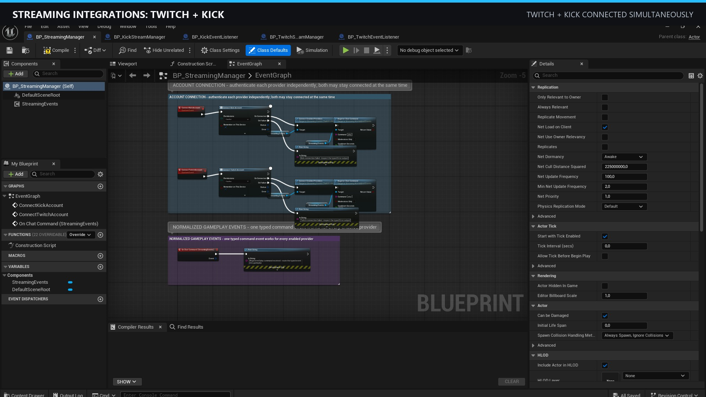
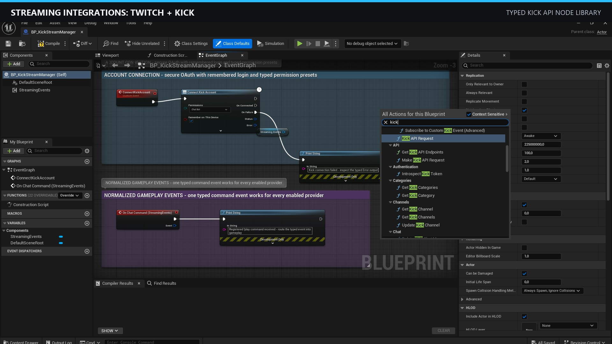
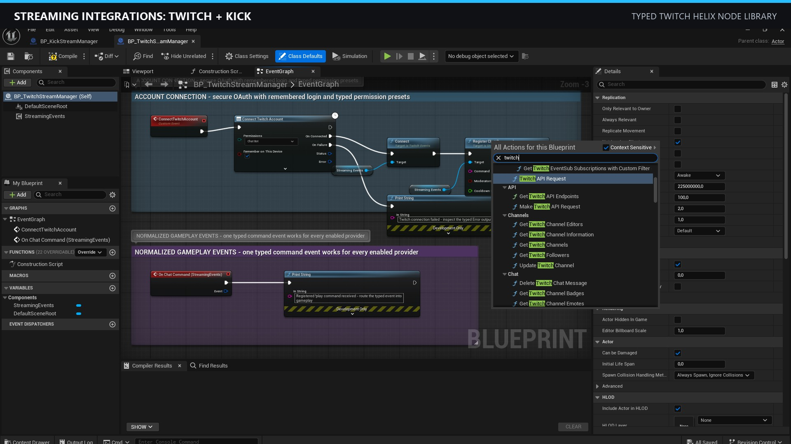
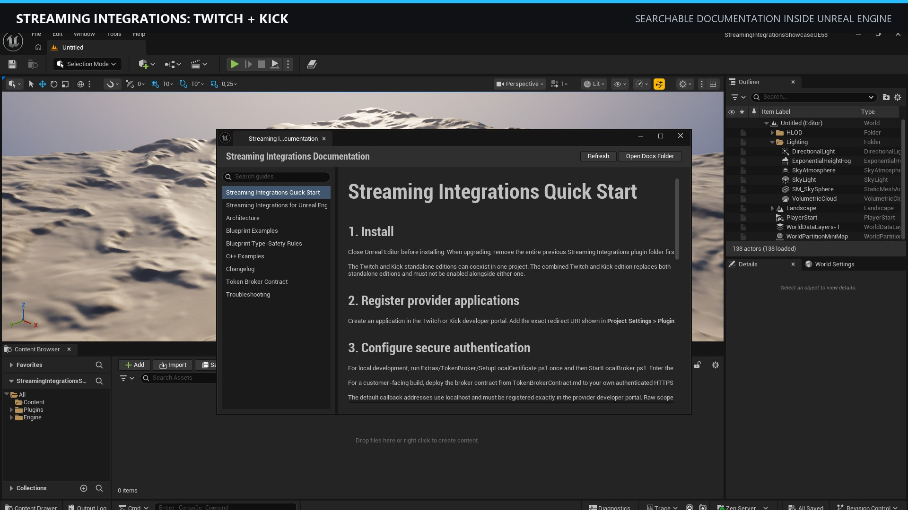

# Streaming Integrations: Twitch & Kick

Documentation and support resources for **Streaming Integrations: Twitch & Kick**, a unified Blueprint and C++ integration plugin for Unreal Engine.

The plugin can connect Twitch, Kick, or both providers simultaneously and provides provider-neutral events, chat-command routing, typed provider APIs, authorization, editor setup tools, diagnostics, UI assets, and example Blueprints.

## Documentation

- [Quick Start](docs/QuickStart.md)
- [Blueprint Examples](docs/BlueprintExamples.md)
- [C++ Examples](docs/CppExamples.md)
- [Kick Event Bridge](docs/KickEventBridgeReference.md)
- [Authentication and Token Broker](docs/TokenBrokerReference.md)
- [Troubleshooting](docs/Troubleshooting.md)
- [Support](docs/Support.md)

The commercial plugin source and binaries are not distributed through this repository.

## Unreal Engine Screenshots

Copyright 2026 Major Elk. All rights reserved.
